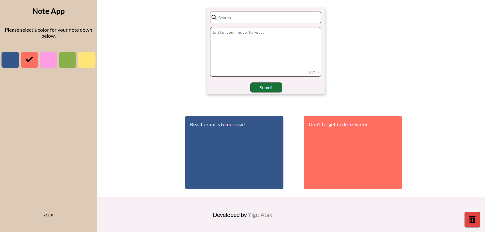
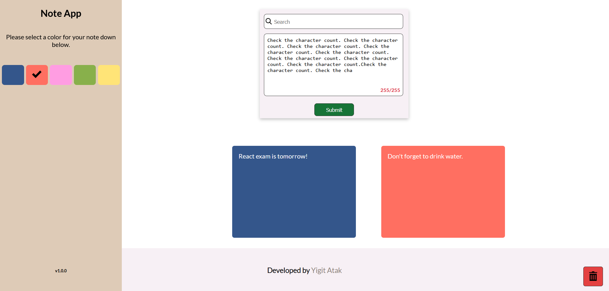
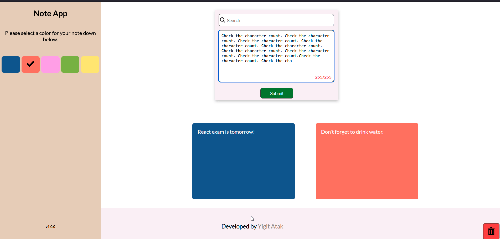

## Note App by Yiğit Atak

### About the project
Note App helps you keep notes for yourself. It has an easy-to-use interface and the ability to drag-and-drop for deleting notes you've written. This project likely won't be updated further and I'll move onto new projects. Suggestions for improvement are welcome, feel free to also fork the project and work on improvements yourself if you wish. Check the to-do list down below for my current road map for this project.

### Built with
This project uses multiple libraries and frameworks.
- [React](https://tr.reactjs.org/)
- [Redux Toolkit](https://redux-toolkit.js.org/)
- [uid](https://www.npmjs.com/package/uid)
- [react-dnd](https://react-dnd.github.io/react-dnd/about)

### Getting Started
You need the following tools for installation:
- [NPM](https://www.npmjs.com/)

#### Installation
1. Clone the repo.
`git clone https://github.com/Arintia/note-app.git`
2. Navigate to the newly created folder.
`cd note-app`
3. Install all the dependencies.
`npm i`
4. Boot it up.
`npm start`
5. Happy coding!

### Usage
This project can be used to keep notes for yourself. It's easy-to-use and it saves your notes on your browser. You'll be able to see the same notes as long as you keep using the same browser. You can also customize the background of your notes. 

### Roadmap
- [X] Implement localStorage to maintain state across page refresh.

### Contributing
Contributions are what make the open source community such an amazing place to learn, inspire, and create. Any contributions you make are **greatly appreciated**.

If you found a bug or if you have a suggestion, feel free to fork this repo and create a pull request. Also feel free to open an issue and I'll get to it when I have time! If you want to work on your enhancement on your own, here's how you can achieve that:

1. Fork the project
2. Create a branch (`git checkout -b feature/SomeNewFeature`)
3. Commit your changes after you're done (`git commit -m "Add Some New Feature"`)
4. Push your commit (`git push origin feature/SomeNewFeature`)
5. Open a pull request
6. Wait for me to review it and merge it or suggest changes!

### License
This project is distributed under the [MIT](https://choosealicense.com/licenses/mit/) license. 

### Contact
You can connect with me on [LinkedIn](https://www.linkedin.com/in/yigitatak/)